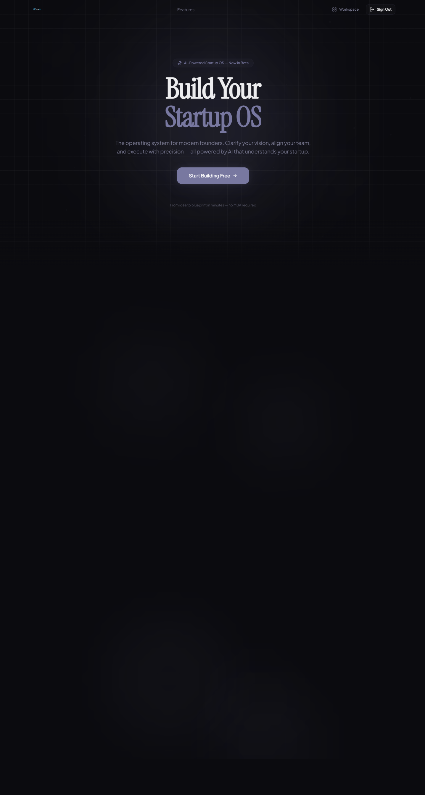
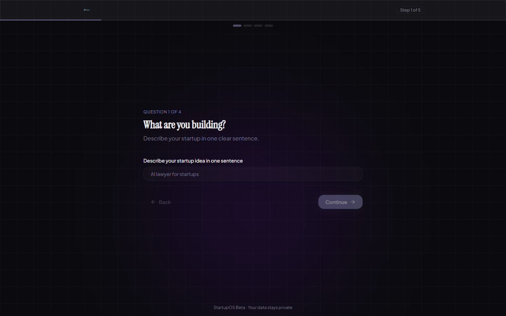
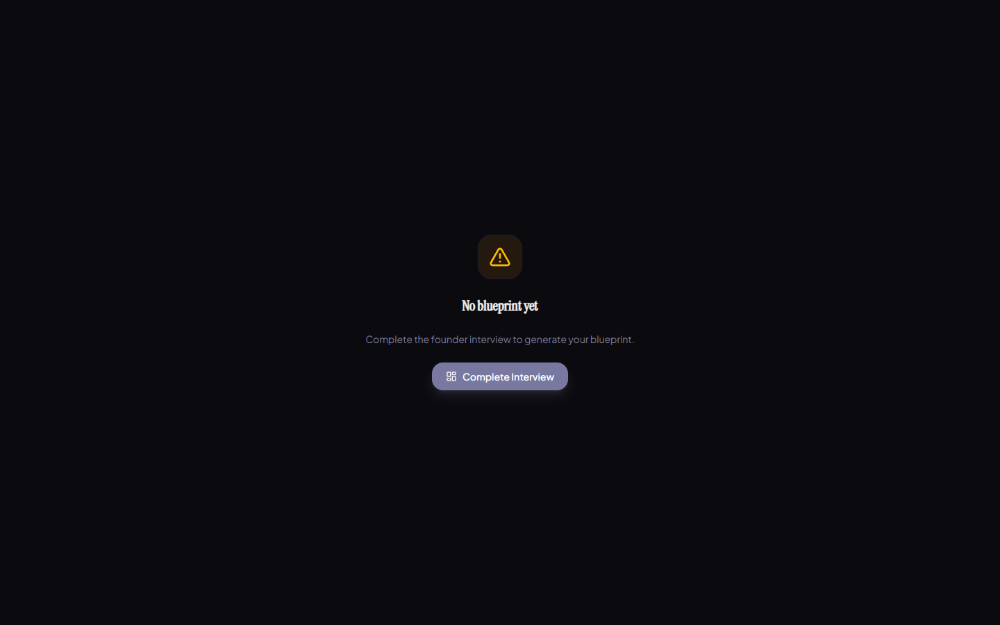
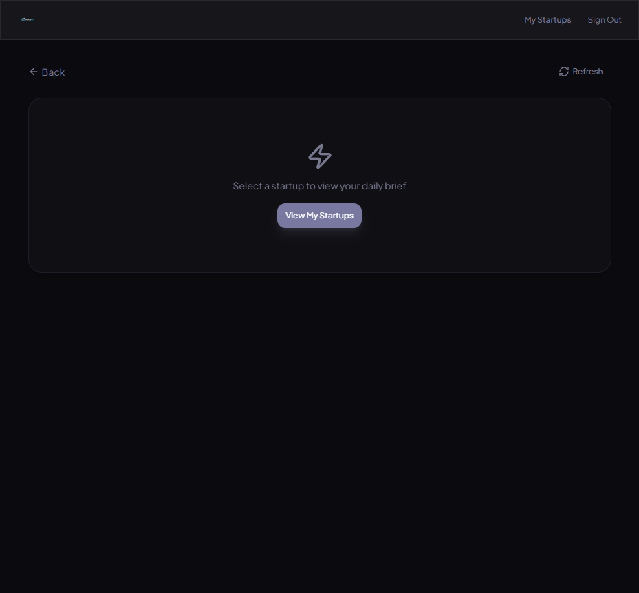
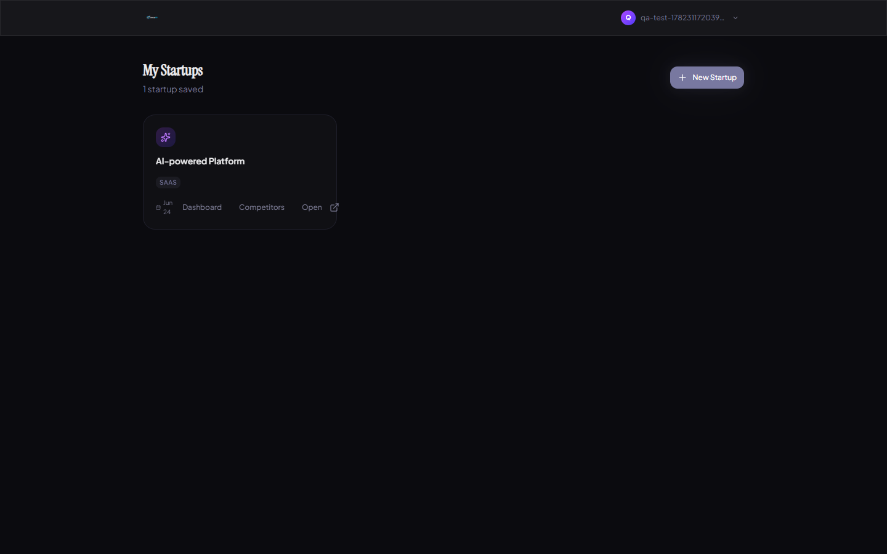
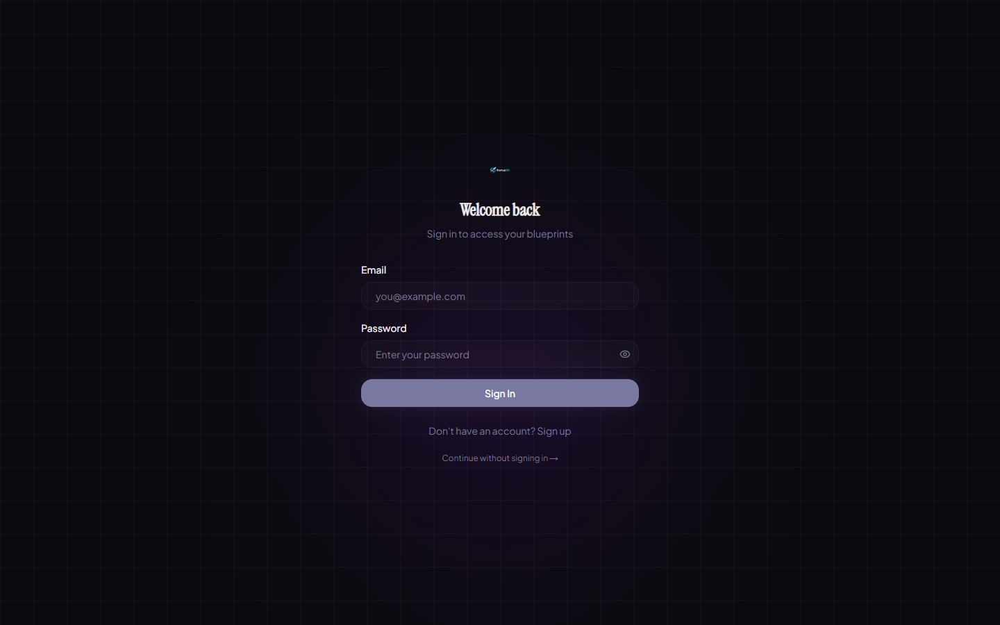

# StartupOS

The operating system for founders who'd rather build than pitch.



## [Try it live →](https://startupos.app)

Free. No credit card. Just you and a terminal.

---

## Why I built this

I had a startup idea. Then another one. Then seven more.

The problem wasn't that I lacked ideas — it was that I couldn't keep track of any of them. My customer research was in Notion. My revenue model was in a Google Sheet. My competitive analysis was a half-finished doc I started at 2am and never opened again. My "brand strategy" was a vibe.

I wanted one place where I could sit down, answer a structured set of questions about my idea, and walk out with a real blueprint. Not a pitch deck template. Not a business plan PDF. An actual working document with market analysis, customer profiles, revenue projections, and a roadmap I could actually follow.

So I built it. And I made it look like a terminal because I was sick of every AI tool looking like a purple Figma mockup from Dribbble.

## What it does

You answer questions about your startup — what you're building, who it's for, how you'll make money, what problem you're solving. The AI takes that and generates a complete blueprint with:

- **Verdict** — A scored assessment across 7 dimensions (market, timing, competition, defensibility, founder-fit, distribution, revenue). It tells you if your idea is worth pursuing. Brutally.
- **Brand Identity** — Mission, values, tone of voice, color palette, typography. Generated from your actual positioning, not generic advice.
- **ICP Builder** — Your ideal customer profile. Who they are, what they care about, where to find them.
- **Revenue Model** — Pricing strategy, unit economics, revenue projections. Real numbers, not vibes.
- **Smart Roadmap** — A product roadmap that adapts to your stage and market.
- **Startup Roast** — The AI roasts your idea. It's harsh. It's also usually right.
- **Dashboard** — Health score, ASCII progress bars, a fortune cookie, and a death predictor. Because startup life is grim and you might as well have fun with it.
- **Competitor Intelligence** — Track competitors with snapshot history and change detection.

## Tech stack

- **Frontend:** Next.js 16, React 19, TypeScript, TailwindCSS v4, Framer Motion
- **Backend:** Fastify, Node.js, Prisma ORM
- **Database:** PostgreSQL
- **AI:** Multiple providers with automatic failover (Gemini, OpenAI-compatible)
- **Auth:** Supabase
- **Deployment:** Vercel (frontend), Railway (backend)
- **Testing:** Playwright (61 E2E tests)

## How it works

The frontend is a Next.js app with Turbopack. All pages are static by default. Auth state lives in React context with a custom Supabase SSR client. API calls go through a centralized client that handles 401 redirects, token expiry, and error messages that don't make you want to throw your laptop.

The backend is a Fastify server with a module-based structure. Blueprint generation flows through a provider registry — if one AI provider fails, it falls through to the next. I added cooldown logic because Gemini once timed out 3 times in a row during a demo. Never again.

Here's roughly how blueprint generation works:

```
Interview → Create startup → Generate prompt → Provider registry →
AI call (with failover) → Validate response → Parse JSON →
Persist to DB → Return to frontend
```

The frontend uses TanStack Query for data fetching. Caching is aggressive. Refetch logic is conservative. I learned the hard way that refetching a blueprint mid-generation causes the most confusing states imaginable.

## Running locally

```bash
git clone https://github.com/yourusername/startupos.git
cd startupos

# Frontend
cd apps/frontend
npm install
npm run dev

# Backend
cd apps/backend
npm install
npm run dev
```

Frontend runs on `http://localhost:3000`. Backend runs on `http://localhost:3001`.

## Environment variables

**Frontend** (`apps/frontend/.env.local`):

```
NEXT_PUBLIC_SUPABASE_URL=your_supabase_url
NEXT_PUBLIC_SUPABASE_ANON_KEY=your_supabase_anon_key
NEXT_PUBLIC_API_URL=http://localhost:3001
```

**Backend** (`apps/backend/.env`):

```
DATABASE_URL=your_postgres_connection_string
SUPABASE_SERVICE_KEY=your_supabase_service_key
SUPABASE_URL=your_supabase_url
GEMINI_API_KEY=your_gemini_key
OPENAI_API_KEY=your_openai_key
CORS_ORIGIN=http://localhost:3000
```

You'll need a Supabase project and at least one AI provider key. I run both Gemini and OpenAI and let the failover system handle the rest.

## The bugs that almost broke me

**Blueprint reliability was a nightmare.** AI providers timeout. They return malformed JSON. They hallucinate fields that don't exist in your schema. I built a multi-provider failover system with cooldown logic, but even that wasn't enough. I had to add Zod validation on every response, a JSON extraction layer that handles common malformations, and front-end retry logic that reuses the same startup ID instead of creating duplicates. There was a week where Gemini kept returning `"verdict": "your startup is bad"` as a string instead of a nested object. I still have nightmares.

**Hydration bugs made me question my career choices.** Next.js + browser extensions + localStorage interactions = random crashes. The footer was rendering the current year server-side and then React would flip out when the client-side year didn't match. I learned to use `suppressHydrationWarning` and defer dynamic values to client effects. Simple fix. Took me 3 hours to find.

**The sidebar race condition was evil.** `useSearchParams().get("id")` returns null on the first render after `router.push()`. This meant the workspace would flash an empty state before getting the URL parameter. I fixed it with a `paramsReady` guard, fallback to `window.location.search`, and localStorage persistence. The fix is 15 lines. Finding it took 2 days.

**Onboarding dead-ends.** If a user selected "one-time" as their business model, a conditional field for price range would hide. But the validation still checked it. I had to add `showIf` awareness to the validation function so hidden fields don't block form submission. This one was so stupid I almost rage-quit.

**The refresh problem.** TanStack Query refetches on mount by default. If the server takes 30 seconds to generate a blueprint, refetching every time the user navigates away and back is a terrible experience. I had to tune the stale time, implement retry guards, and add auth-aware error handling that doesn't pop you out to the login screen mid-generation.

## Testing

I wrote 61 Playwright tests because I got tired of manually clicking through the same flows every time I changed something. The test suite covers:

- Public pages (including hard refresh recovery)
- Authentication (sign up, login, logout, wrong password, duplicate email, session expiry)
- Founder interview (all steps, all dropdowns, conditional fields, validation on every step)
- Blueprint generation (single generation, retry on failure, 5 consecutive generations without duplicates)
- Workspace (all 8 tabs, rapid switching, refresh preserves state)
- Dashboard (every widget, fortune cookie persistence, death predictor calculations)
- Competitors and brief pages (CRUD, empty states, refresh recovery)
- Mobile (375px viewport, no horizontal scroll, all buttons reachable)
- Stress tests (rapid navigation, spam-clicking, double submission, refresh during API calls)
- Error handling (401 responses show friendly messages, logged-out states redirect gracefully)

All 61 tests pass. The build compiles with zero TypeScript errors.

## What I'd improve next

- **Multi-user workspaces** — right now it's single-user. I want team access with roles.
- **Real competitor monitoring** — currently it's snapshot-based. I want weekly automated briefs.
- **Template system** — different startup types (SaaS, marketplace, hardware) need different blueprint structures.
- **Integrations** — Stripe for real revenue data, GitHub for commit activity, Linear for task velocity.
- **Mobile app** — push notifications for critical startup events. Founders live on their phones.
- **Community features** — share blueprints, get feedback from other founders. Build in public, but structured.
- **Better AI prompts** — the blueprint quality varies. I want to fine-tune prompts per industry.

## Screenshots

| Landing | Interview | Workspace |
|---------|-----------|-----------|
|  |  |  |

| Dashboard | Blueprints | Auth |
|-----------|------------|------|
|  |  |  |

## Acknowledgements

- Built with Next.js, Fastify, Supabase, and an unreasonable amount of terminal green
- AI providers: Google Gemini, OpenAI-compatible endpoints
- Fonts: JetBrains Mono, Plus Jakarta Sans
- Icons: Lucide
- Animations: Framer Motion
- The entire shadcn/ui ecosystem for component primitives
- Every founder who told me "this is actually useful" — you're the reason this exists

---

*Built by a founder who got tired of AI SaaS templates and decided to build something that looks like it belongs in a terminal. Ship fast. Stay technical. Don't use purple.*
